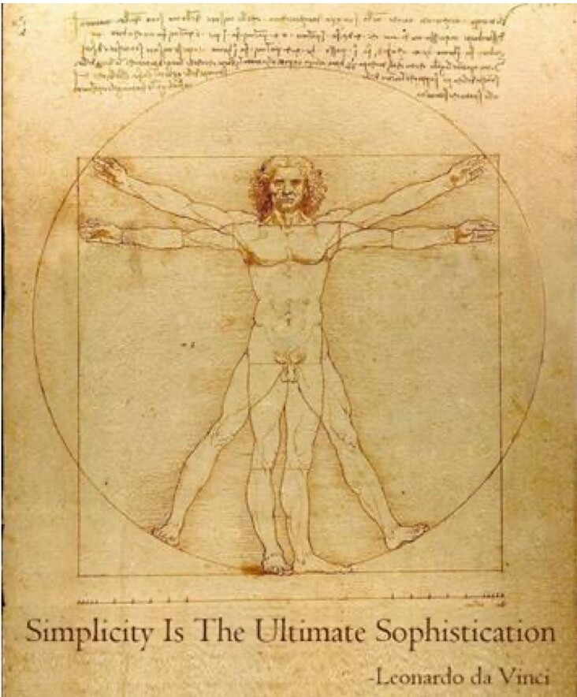

<!-- page 35 | i -->

# General introduction

*Figure description: Leonardo da Vinci's drawing of the Vitruvian Man on aged, sepia-toned paper: a nude male figure with arms and legs shown in two superimposed positions, inscribed in a circle and a square, with lines of handwritten mirror script across the top of the sheet. Text in the image, printed across the bottom of the picture: "Simplicity Is The Ultimate Sophistication" and, below it at the right, "-Leonardo da Vinci".*

## What is ASD-STE100 Simplified Technical English?

ASD-STE100 Simplified Technical English (STE) is a controlled natural language and an international standard to write technical documentation.

STE has two parts: a set of writing rules (part 1) and a controlled dictionary (part 2). The writing rules are about grammar and style. The dictionary gives the approved words that a writer can use.

## When and why was STE developed?

English is the international language of science, technology, and human relations. It is also the language of the aerospace and defense industry. However, it is not often the native language of the readers of technical documentation. Many readers have a limited knowledge of English. The large number of meanings and synonyms that many English words have, and a complex sentence structure, can cause confusion.

In aerospace, it is important to correctly understand maintenance and operation documentation to make sure that systems operate safely and correctly and to protect human lives.

In the late 1970s, the Association of European Airlines (AEA) asked the European Association of Aerospace Industries (AECMA, now ASD [www.asd-europe.org](https://www.asd-europe.org)) to investigate the readability of maintenance documentation in the civil aviation industry and find a solution to simplify the language used to write such documentation.

AECMA asked the Aerospace Industries Association (AIA) of America to help with this project and two project groups from AECMA and AIA were formed. These two groups explored the existing controlled natural languages and researched texts in many maintenance manuals. The results confirmed that a simplified language for aerospace was necessary.

On June 30, 1983, in Amsterdam, the AECMA Simplified English Working Group was founded and the AECMA Simplified English project started.

The product of this effort was the AECMA Simplified English Guide (first released in 1986) which, in 2005, became ASD-STE100 Simplified Technical English.

In 1987, the Air Transport Association of America (ATA) included the requirement to write in STE in its ATA100 specification for technical publications. Thus, the current name ASD-STE100 was assigned as a tribute to the name of the ATA100 specification.

Today, the success of STE is such that other industries use it beyond its original intended purpose of aerospace maintenance documentation. Interest in STE has also increased dramatically in the areas of language services, professional translation and interpreting, and in the academic world.

<!-- page 36 | ii -->

## What is the purpose of STE?

The purpose of STE is to tell technical writers how to write technical texts in a clear, simple, and unambiguous manner that readers throughout the world will find easy to understand. STE is not a treatise on the English language or technical writing. Thus, linguistic and grammar aspects are not fully included in this document because they are explained in other language reference books and guidelines.

## Which words are available to the writer?

STE has a controlled dictionary that gives the words that are most frequently used in technical writing.

The approved words were selected because they were simple and easy to recognize. In general, each word has only one meaning and is approved with only one part of speech. For example, “to fall” has the approved meaning of “to move down by the force of gravity,” and not “to decrease.”

When there are synonyms in English, STE selects one synonym and does not include the others. For example, STE uses “start” instead of “begin,” “commence,” “initiate,” or “originate.”

STE approved meanings and spelling are based on American English and the Merriam-Webster’s dictionary.

Writers can use the approved words in the dictionary as a core vocabulary. Writers can also use noun terms and verb terms that are applicable to their companies, industries, or subject fields. STE identifies these terms as “technical nouns” and “technical verbs” and gives the necessary rules to use these terms correctly.

## Does STE give rules for abbreviations?

No. Industries, companies, and projects can use different abbreviations. Thus, rules for abbreviations are not necessary in STE.

## Does STE regulate text formatting?

No. STE regulates the way to express the content. It does not regulate formatting, for example, typeface, numbering, and lettering. Usually, these requirements are included in the applicable specifications for technical publications, style guides, and other official directives.

## Does STE regulate units of measurement?

No. There are different methods to show units of measurement in a technical text. Projects and companies must decide which one to use. Usually, these requirements are included in the applicable specifications for technical publications, style guides, and other official directives.

## Can STE be used alone?

No. It is intended to be used with other applicable specifications for technical publications, style guides, and official directives. A high standard of professionalism is necessary to use STE correctly.

<!-- page 37 | iii -->

## Can STE be used for oral communication?

STE was developed for technical documentation only. But the rules and a controlled dictionary can help oral communication in meetings and presentations.

## Can STE be used to teach a writer English?

No. STE is not an English course book. STE will help the writer give complex information in a form that is easy to understand. Writing clearly is a complex task, and it is necessary to have a high level of fluency in English to write STE correctly.

## Can STE help technical translation?

Yes. One of the primary objectives of STE is to make translation easier. If the permitted words, the meanings of such words, and the types of sentence constructions in a text are controlled, the difference between texts will decrease to a minimum. Thus, it is easier for translators, neural machine translation engines, and Large Language Models (LLM) to translate text written in STE into the target language.

## Can writers get training in STE and find supporting authoring tools?

There are organizations, companies, and individuals that market and give training courses in how to use STE, and there are producers of authoring tools that support STE.

Neither ASD, the Simplified Technical English Maintenance Group (STEMG), nor any organization or company associated with the production of STE intend or imply any warranty or endorsement to these organizations, companies, and individuals that give training or produce authoring tools.

For training only, the above statement is not applicable to organizations, companies, and individuals who, through official agreements, are accredited by ASD to give authorized training.

For more information, refer to the STEMG website at [www.asd-ste100.org](https://www.asd-ste100.org).
