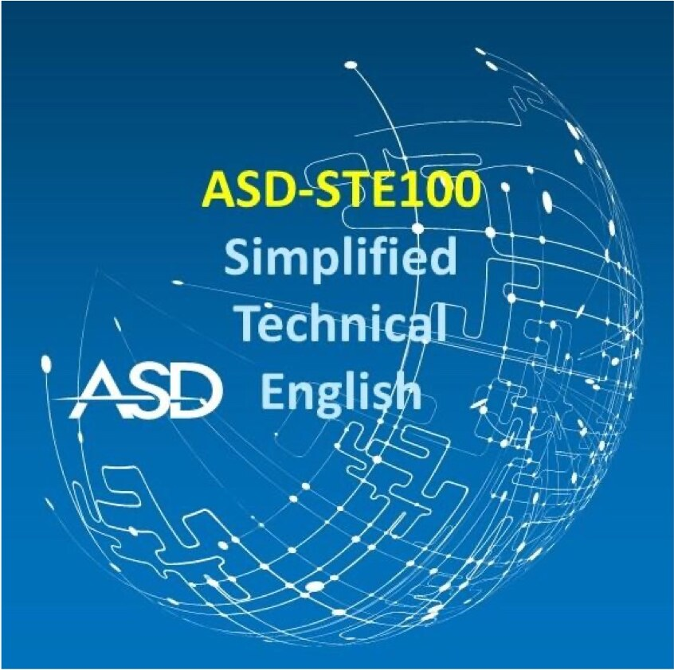

<!-- page 1 | — -->
<!-- ASD logo (large, blue) printed centered above the cover picture; not reproduced -->

*Figure description: A square picture with a blue gradient background (dark blue at the top, lighter blue at the bottom). A white wireframe globe fills most of the picture. It is made of curved lines, dots and circuit-like paths. Text in the image, centered in four lines: “ASD-STE100” (in yellow), then “Simplified”, “Technical” and “English” (in pale blue). To the left of “English” is a white ASD logo.*

# ASD-STE100

## Simplified Technical English

**European Union Trade Mark No. 017966390**

## Standard for technical documentation

**ISSUE 9, JANUARY 2025**

Aerospace, Security and Defence Industries Association of Europe

Rue du Trône 100, 1050 Brussels, Belgium 
info@asd-europe.org 
www.asd-europe.org 
© ASD, 2025 – All rights reserved

<!-- page 2 | — -->
# Copyright notices

## Copyright

The information in this document is the property of the Aerospace, Security and Defence Industries Association of Europe (ASD). Transmittal, receipt, or possession of the information does not express license or imply any rights to use, sell, or manufacture from this information and no reproduction or publication of it, in whole or in part, shall be made without the written authority of an officer of ASD.

The copyright for this document, in whole or in part, is fully owned by:

**Aerospace, Security and Defence Industries Association of Europe (ASD)** 
Rue du Trône 100, 1050 Brussels, Belgium 
[www.asd-europe.org](https://www.asd-europe.org)

© ASD, 2005, 2007, 2010, 2013, 2017, 2021, 2025

(previously AECMA, 1986, 1987, 1988, 1989, 1995, 1998, 2001, 2004)

ASD-STE100 Simplified Technical English is a European Union (EU) registered trademark owned by ASD

® ASD, 2006 (004901195), 2018 (017966390)

## Special usage rights

Irrevocable permission to use, reproduce or publish this document or any subsequent modification or revision thereof, in whole or in part, free of charge, is hereby given to these organizations and institutions:

1. National Associations who are members of ASD, and all their member companies
2. Members of Aerospace Industries Association of America (AIA) and Canada (AIAC)
3. Members of International Coordinating Council of Aerospace Industries Associations (ICCAIA) not included in categories 1 thru 2
4. Customers of companies included in categories 1 thru 3
5. Ministries of Defense of the member countries of ASD, AIA, and AIAC
6. Airlines for America (A4A), formerly known as Air Transport Association of America (ATA)
7. Airworthiness Authorities
8. Universities and research institutes for educational purposes.

## Disclaimer of liability

The purpose of this document, including its writing rules, dictionary entries, and all their related examples, is solely to offer recommendations and definitions intended to assist in technical communication. This document is not intended to create legal obligations or confer legal rights. No part of this document should be interpreted as having legal significance or implications, regardless of the context in which it is used.
