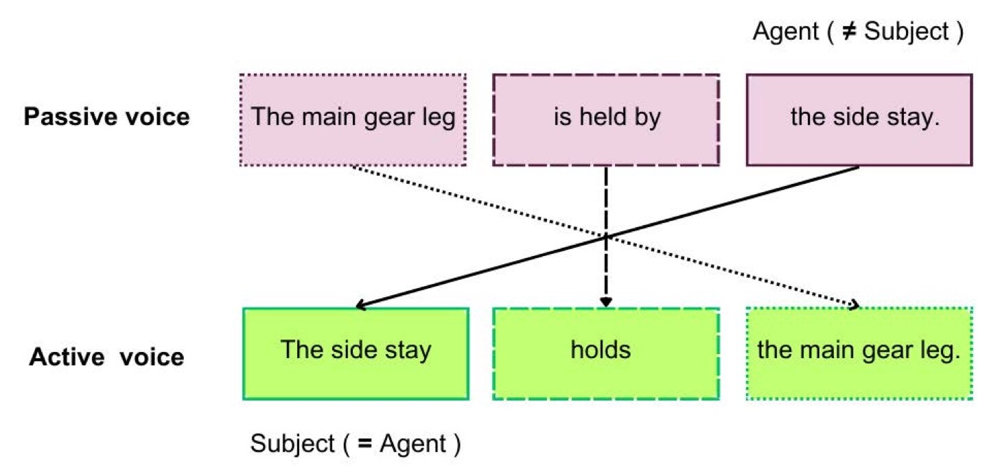
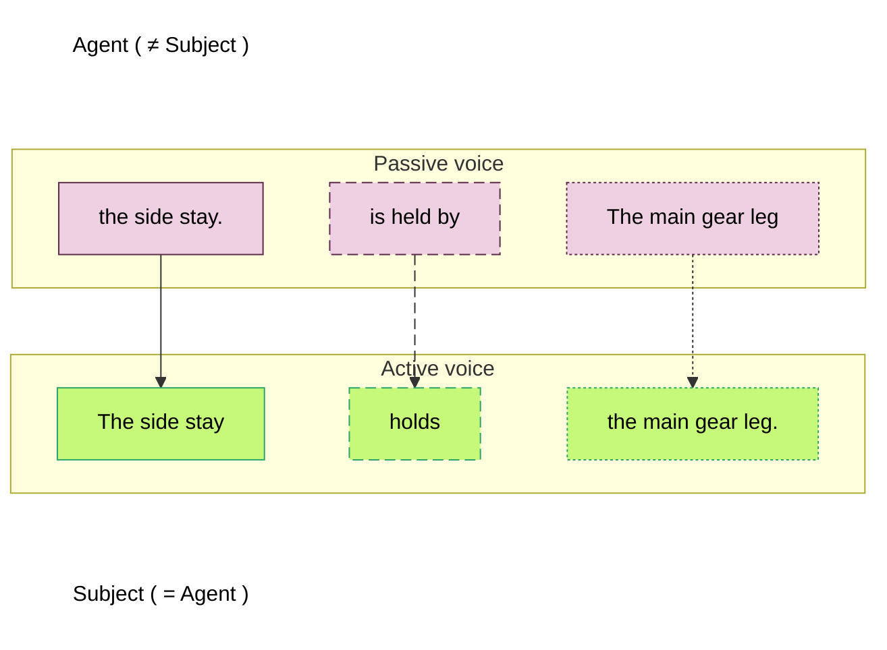

<!-- page 71 | 1-3-5 -->
# Rule 3.6

> **Rule 3.6** **Use the active voice. In descriptive writing, you can use the passive voice only if the agent is unknown.**

Technical texts consist of procedural writing and descriptive writing. When you write in STE, <u>always use the active voice</u>. In descriptive writing, the passive voice is permitted <u>only</u> when the agent (the person or thing that does the action) is unknown.

## What is active voice?

In the active voice, the subject of the sentence does the action of the sentence (“A” does “B”). Thus, the grammatical subject (A) is also the logical subject (agent).

## What is passive voice?

In the passive voice, the subject of the sentence receives the action (“B” is done by “A”). Here, the grammatical subject is B, and the logical subject, or agent, is A.

**General examples**:

- [STE] **Active:** The manufacturer gives the safety procedures.
- [Neutral] **Passive:** *The safety procedures are given by the manufacturer.*

- [STE] **Active:** The side stay holds the main gear leg.
- [Neutral] **Passive:** *The main gear leg is held by the side stay.*

<!-- page 72 | 1-3-6 -->
## How do you know if a sentence is in the passive voice?

The best test for the passive voice is to think of the question “by whom or by what?” (the agent). If your text gives you an answer to this question, then the text is in the passive voice. When a sentence contains the preposition “by,” it is a good indication that the sentence is in the passive voice. The object of the preposition “by” is then the agent and you can use the agent as the subject of a sentence in the active voice. In the examples that follow, the underlined text identifies the agent.

In each of the passive examples, you can think of the question “by whom or by what?”

- [Neutral] *The safety procedures are given by<u> the manufacturer</u>.*

- [Neutral] *The main gear leg is held by <u>the side stay</u>.*

But a passive construction does not always contain an agent.

- [Neutral] *The dimensions are given in the table.*

- [Neutral] *The main gear leg is held in its position.*

A sentence in the active voice always has a grammatical subject (the agent), but in the passive sentence in the example below, <u>the agent is unknown</u> (and we do not know the cause of data corruption). In the active sentence, the agent (“transmission”) is incorrect (“transmission” is <u>not</u> the cause of data corruption), and the meaning of the sentence is different. Thus, the active sentence becomes technically incorrect.

**Example:**

- [STE] **Passive:** During transmission, the data <u>was corrupted</u>. (Correct, the agent is unknown.)
- [STE] **Active:** During transmission, something corrupted the data. 
  (Correct, you do not know the identity of “something,” but you can use it as the agent.) 
- [Neutral] **Active:** *Transmission corrupted the data. (Incorrect, “transmission” is not the correct agent.)*

In the example, if you use the word “something” (“a thing that is not determined or specified”) as the agent, the active voice will be technically correct.

## How do you change a sentence that is in the passive voice to the active voice?

To change a sentence from the passive voice to the active voice, you can use one of these four methods:

## Method 1

When the sentence gives the agent (usually the object of the preposition “by”), put the agent at the start of the sentence. Then, use the agent as the subject. The subject must always be the noun that does the action in the sentence, as shown in the diagram that follows:

<!-- page 73 | 1-3-7 -->

*Figure description: A diagram in two rows of three boxes. The top row is labeled “Passive voice” and has three pink boxes: “The main gear leg” (dotted border), “is held by” (dashed border) and “the side stay.” (solid border). The text “Agent ( ≠ Subject )” is printed above the box “the side stay.”. The bottom row is labeled “Active voice” and has three green boxes: “The side stay” (solid border), “holds” (dashed border) and “the main gear leg.” (dotted border). The text “Subject ( = Agent )” is printed below the box “The side stay”. Three arrows go from the top row to the bottom row: a solid arrow from “the side stay.” to “The side stay”, a dashed arrow from “is held by” to “holds”, and a dotted arrow from “The main gear leg” to “the main gear leg.”. The three arrows cross at one point, below the “is held by” box.*

**Example:**

- [Non-STE] **Non-STE:** *The circuits are connected by a <u>switching relay</u>.* (Passive)
- [STE] **STE:** A <u>switching relay</u> connects the circuits. (Active)

## Method 2

Change an infinitive verb to an active verb.

**Example:**

- [Non-STE] **Non-STE:** *These values are used by the computer <u>to calculate</u> the energy consumption.* (Passive)
- [STE] **STE:** The computer <u>calculates</u> the energy consumption from these values. (Active)

The construction “are used by” gives no important information here. Thus, you can use the verb “calculate” to write the sentence in the active voice.

## Method 3

In procedural writing, change the verb to the imperative (“command”) form.

**Examples:**

- [Non-STE] **Non-STE:** *The test <u>can be continued</u> by the operator.* (Passive)
- [STE] **STE:** <u>Continue</u> the test. (Active)

- [Non-STE] **Non-STE:** *Oil and grease <u>are to be removed</u> with a degreasing agent.* (Passive)
- [STE] **STE:** <u>Remove</u> oil and grease with a degreasing agent. (Active)

<!-- page 74 | 1-3-8 -->
## Method 4

When the agent (the person or thing that does the action) is not given in the sentence, you can use the pronouns “you” or “we” as subjects in the active form. If the agent is the reader, use “you.” If the agent is your company, or organization, use “we.”

**Examples:**

- [Non-STE] **Non-STE:** *On the ground, the valve <u>can be opened </u>with the override handle.* (Passive<em>)</em> <!-- sic: closing parenthesis printed in italic -->
- [STE] **STE:** On the ground, <u>you can open</u> the valve with the override handle. (Active)

- [Non-STE] **Non-STE:** *Additives <u>are not used</u> in this type of fuel.* (Passive)
- [STE] **STE:** <u>We do not use</u> additives in this type of fuel. (Active)
- or
- [STE] **STE:** This type of fuel <u>does not contain</u> additives.

When you find complex sentences in the passive voice that include auxiliary verbs, decide if you want to write a procedural sentence or a descriptive sentence.

**Examples:**

- [Non-STE] **Non-STE:** *The volume control <u>can be adjusted</u>.*
- [STE] **STE:** Adjust the volume control. (Procedural sentence)
- [STE] **STE:** You can adjust the volume control. (Descriptive sentence)

- [Non-STE] **Non-STE:** *The oil temperature <u>must be adjusted</u> before the start of the test.*
- [STE] **STE:** Before you start the test, adjust the oil temperature. (Procedural sentence)
- [STE] **STE:** Before the start of the test, the operator must adjust the oil temperature. (Descriptive sentence)

- [Non-STE] **Non-STE:** *The valve <u>will be adjusted</u> during the test.*
- [STE] **STE:** During the test, adjust the valve. (Procedural sentence)
- [STE] **STE:** NOTE: You will adjust the valve during the test. (Descriptive sentence)

- [Non-STE] **Non-STE:** *The component <u>is to be installed</u> before you do the test.*
- [STE] **STE:** Before you do the test, install the component. (Procedural sentence)
- [STE] **STE:** Before the test, the operator must install the component. (Descriptive sentence)
