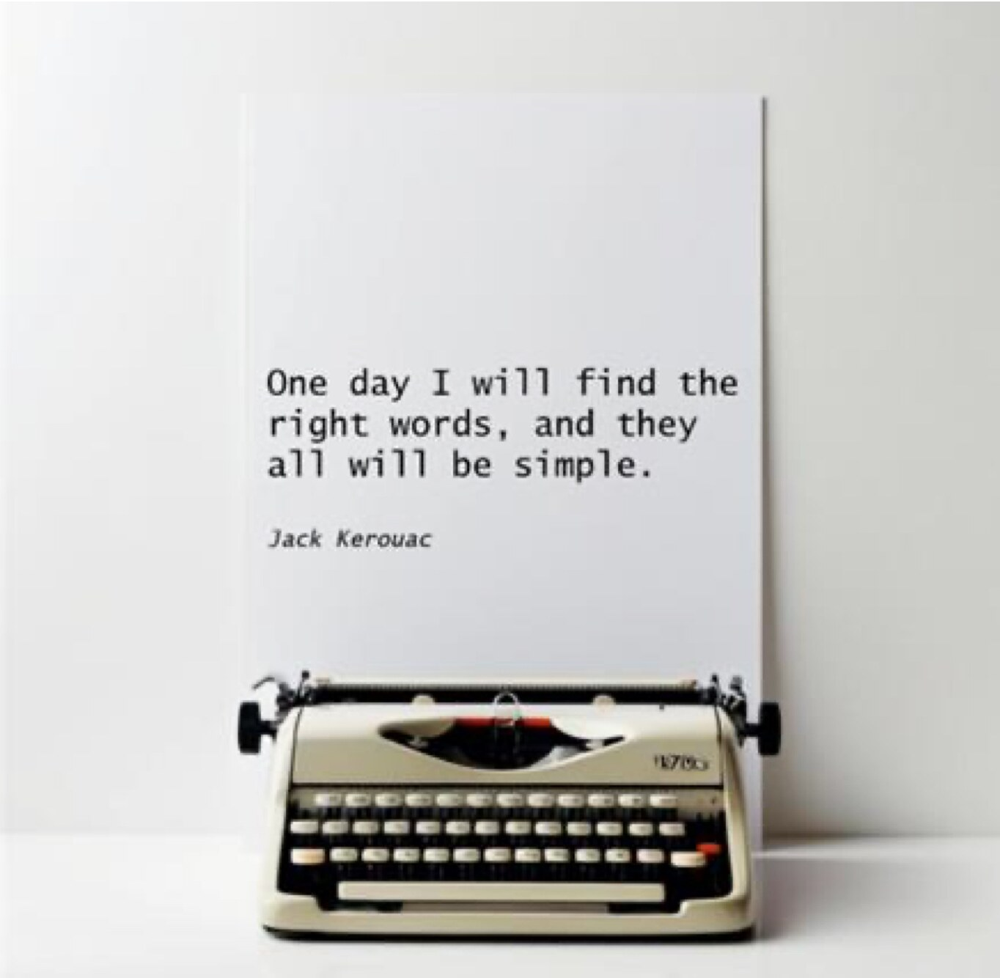

<!-- page 129 | 2-0-1 -->

# Part 2 – Dictionary

*Figure description: A photograph of a cream-colored manual typewriter with black keys on a white surface. Behind it, a tall sheet of white paper leans against a light grey wall. Text in the image (typewritten on the paper, in three lines): “One day I will find the right words, and they all will be simple.” Below it, in smaller italic type: “Jack Kerouac”. A small model badge on the right front of the typewriter is not legible.*

Kerouac, J. (1958). *The Dharma Bums.*

<!-- index:start -->
## How to look up a word

- Quick lookup: [index.md](index.md) lists every headword with its status and alternatives. It is one file, so you can search all of it at once.
- Full entries: `words/<letter>.md`. Each headword is a `## WORD (pos)` heading. UPPERCASE means approved; lowercase means not approved.

## Introduction

- [General](introduction/general.md)
- [Guide to the dictionary](introduction/guide-to-the-dictionary.md)
- [How to select words correctly](introduction/how-to-select-words.md)
- [List of recurring errors](introduction/recurring-errors.md)
- [List of approved verbs](introduction/approved-verbs.md)

## Words

[A](words/a.md) · [B](words/b.md) · [C](words/c.md) · [D](words/d.md) · [E](words/e.md) · [F](words/f.md) · [G](words/g.md) · [H](words/h.md) · [I](words/i.md) · [J](words/j.md) · [K](words/k.md) · [L](words/l.md) · [M](words/m.md) · [N](words/n.md) · [O](words/o.md) · [P](words/p.md) · [Q](words/q.md) · [R](words/r.md) · [S](words/s.md) · [T](words/t.md) · [U](words/u.md) · [V](words/v.md) · [W](words/w.md) · [XYZ](words/xyz.md)
<!-- index:end -->
