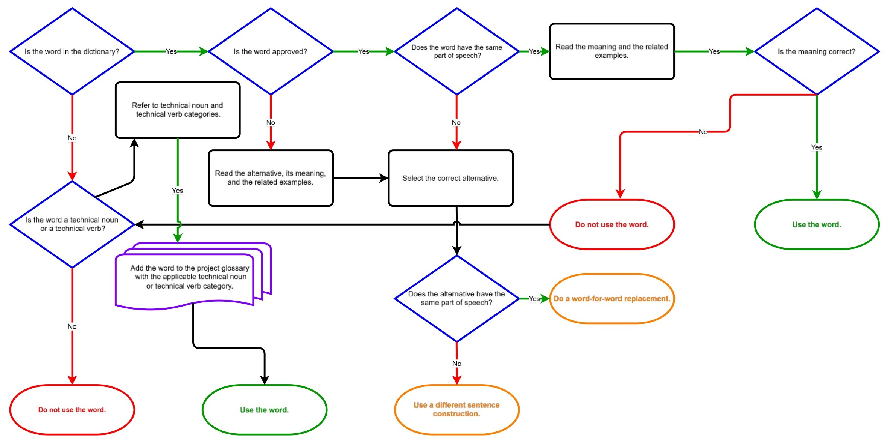

<!-- page 144 | 2-0-16 -->

# How to select words correctly

STE is a controlled natural language with a restricted dictionary.

As a result, it is not possible to use all the words that you want. If you are not sure about a word that you want to use, refer to this flowchart.

*Figure description: A flowchart that reads from left to right along a top row of decisions. Decisions are blue diamonds, actions are black rounded rectangles, one action is a purple multi-page document shape, and each end point is a rounded (stadium) shape whose border and bold text are colored: red for "Do not use the word." (two of them), green for "Use the word." (two of them) and orange for "Do a word-for-word replacement." and "Use a different sentence construction.". "Yes" connectors are green, "No" connectors are red, and unlabeled connectors are black. Top row: "Is the word in the dictionary?" – Yes → "Is the word approved?" – Yes → "Does the word have the same part of speech?" – Yes → "Read the meaning and the related examples." – Yes → "Is the meaning correct?". "Is the meaning correct?" – Yes → "Use the word." (green); No → "Do not use the word." (red), from which a black line goes left to "Is the word a technical noun or a technical verb?". "Is the word approved?" – No → "Read the alternative, its meaning, and the related examples." → "Select the correct alternative.". "Does the word have the same part of speech?" – No → "Select the correct alternative.". "Select the correct alternative." → "Does the alternative have the same part of speech?" – Yes → "Do a word-for-word replacement." (orange); No → "Use a different sentence construction." (orange). "Is the word in the dictionary?" – No → "Is the word a technical noun or a technical verb?". From that diamond a black line goes up to "Refer to technical noun and technical verb categories.", which continues with a green "Yes" line to "Add the word to the project glossary with the applicable technical noun or technical verb category." (purple document shape) and then with a black line to "Use the word." (green). "Is the word a technical noun or a technical verb?" – No → "Do not use the word." (red). The long horizontal black line from the red "Do not use the word." to "Is the word a technical noun or a technical verb?" crosses the line below "Select the correct alternative." (the horizontal line hops over it) and the green "Yes" line (the green line hops over the horizontal line), so these lines do not connect.*

```mermaid
flowchart LR
    Q1{"Is the word in the dictionary?"}
    Q2{"Is the word approved?"}
    Q3{"Does the word have the same part of speech?"}
    B3["Read the meaning and the related examples."]
    Q4{"Is the meaning correct?"}
    B2["Read the alternative, its meaning, and the related examples."]
    B4["Select the correct alternative."]
    Q5{"Does the alternative have the same part of speech?"}
    Q6{"Is the word a technical noun or a technical verb?"}
    B1["Refer to technical noun and technical verb categories."]
    D1["Add the word to the project glossary with the applicable technical noun or technical verb category."]
    E1(["Do not use the word."])
    E2(["Use the word."])
    E3(["Do a word-for-word replacement."])
    E4(["Use a different sentence construction."])
    E5(["Use the word."])
    E6(["Do not use the word."])

    Q1 -->|Yes| Q2
    Q2 -->|Yes| Q3
    Q3 -->|Yes| B3
    B3 -->|Yes| Q4
    Q4 -->|Yes| E2
    Q4 -->|No| E1
    Q2 -->|No| B2
    Q3 -->|No| B4
    B2 --> B4
    B4 --> Q5
    Q5 -->|Yes| E3
    Q5 -->|No| E4
    E1 --> Q6
    Q1 -->|No| Q6
    Q6 --> B1
    B1 -->|Yes| D1
    D1 --> E5
    Q6 -->|No| E6

    classDef decision fill:#ffffff,stroke:#0000dd,stroke-width:2px,color:#000000
    classDef action fill:#ffffff,stroke:#000000,stroke-width:2px,color:#000000
    classDef document fill:#ffffff,stroke:#8000e0,stroke-width:2px,color:#000000
    classDef endRed fill:#ffffff,stroke:#e00000,stroke-width:2px,color:#e00000,font-weight:bold
    classDef endGreen fill:#ffffff,stroke:#008c00,stroke-width:2px,color:#008c00,font-weight:bold
    classDef endOrange fill:#ffffff,stroke:#f08010,stroke-width:2px,color:#f08010,font-weight:bold

    class Q1,Q2,Q3,Q4,Q5,Q6 decision
    class B1,B2,B3,B4 action
    class D1 document
    class E1,E6 endRed
    class E2,E5 endGreen
    class E3,E4 endOrange

    linkStyle 0,1,2,3,4,10,15 stroke:#008c00,stroke-width:2px
    linkStyle 5,6,7,11,13,17 stroke:#e00000,stroke-width:2px
    linkStyle 8,9,12,14,16 stroke:#000000,stroke-width:2px
```

